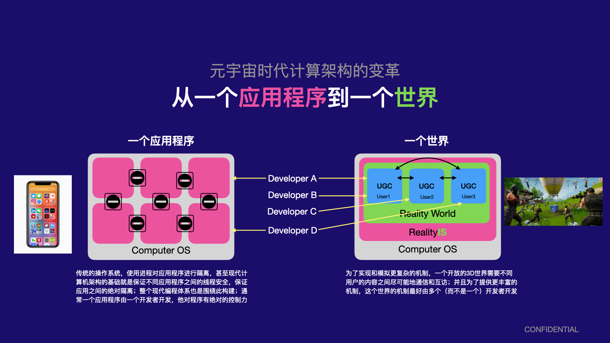

## 形态变化

上述这些变化，从上往下看，可以归结为三个维度的变化：

- **开发者**：由专业开发者向普通用户转移
- **开发方式**：互动内容的开发方式由完全开发到基于事件驱动开发
- **玩家体验**：由完全操控到XR辅助

在开发工具方面，Roblox和Snapchat的Lens Studio都面向普通开发者，它们共同的特点包括简化的脚本，以及一键发布，使得开发者 不需要花费很大的精力去处理平台相关问题。另一方面是这类工具都是深入集成平台的特定功能，例如Lens Studio底层的AR场景理解算法，以及Roblox内置的多人在线服务。**深度集成平台与算法，相比于传统通用游戏引擎，将成为未来的一个方向和优势**。

在开发方式方面，传统的流程需要开发者定义所有的逻辑，包括触发逻辑的机制，这部分尤其复杂。在Snapchat基于AR的互动内容开发中，这类互动内容的驱动完全来源于手机对场景理解，这些都由AR算法来提供，因此开发者不需要处理任何交互驱动方面的逻辑，而只需要关心对交互的响应逻辑。这种方式不仅大大简化了整个互动内容的开发，也从根本上对互动内容开发的流程带来了很大的变革。**简化逻辑开发的触发机制，触发机制数据化，深度与平台集成，是未来互动内容开发走向平民化的重要方式 之一**。当然在这个过程中，基于代理的物体位置摆放机制也起到了很大的辅助作用。

同样借助于事件触发机制的数据化，以及基于XR设备对场景的理解，用户对互动内容的部分操作，由原来主动、精细地控制虚拟摄像机和物体，变为基于场景理解算法的自动驱动，这大大简化了交互成本。

这些各个层面的变化，最终都会导致整个互动内容的制作流程发生较大的变化。

##  计算架构的变化

从开发的角度，从下往上看，这带来的是计算架构的变革。

传统的计算架构都是为单个应用程序设计的，从硬件到软件，所有一切流程和功能都是针对这个模型设计的，例如一个应用程序的所有源码都会被编译和链接到一起，一个应用程序内的数据可能相互引用，所以需要链接器来重新定位每个引用变量的地址。这样的计算架构，非常适合于处理具有独立功能的应用程序。但它有比较致命的缺点：

- 例如，因为所有源代码编译的目标代码都会链接到一起，所以它们从根本上就不支持大规模应用程序，因为这样的应用程序可能由海量的源代码组成。
- 由于源代码之间相互引用，因此它们很难支持应用程序内的独立子程序通信，子程序之间总是需要引用源代码才可以通信，这使得一个应用程序无法成为一个可以自我进化的开放系统，而总是需要一个开发商来进行维护。

随着UGC和元宇宙时代的到来，这种大规模的、具有内生开放子系统的多应用交互架构越来越成为最核心的需求，这需要我们在计算架构上做出较大的变革。

### 业务比喻

比如现在腾讯有非常海量的业务，如微信，音乐，视频等，目前这些业务之间相互是比较独立的，他们组织为相互独立的应用程序，相互比较独立的数据管理，服务器架构和组织，虽然彼此之间存在一定关联，但是这种关联是高度结构化和规则化的，且关联很少。

开放世界则意味着，现在所有这些业务需要在一个应用内组织，它的复杂度是非常高的，架构也非常复杂，数据管理和分布式计算都非常复杂，并且由于传统游戏的逻辑组织方式，在这种体量下根本无法有效管理组织和进行分布式计算。

可行的思路：

- 微服务化
- 函数式编程

微服务化是一种软件架构，需要高度依赖于对逻辑的设计和划分，他不是一种基础编程模型，因此无法支撑开放式的设计，这些微服务通常都只能是开发商设计好的，普通用户没法修改，因此本质上不支持开放世界。

## 技术挑战

从根本上，上述的一些变革带来的技术挑战包括：

- 需要全新支持多应用相互通信的计算架构
- 能够让所有计算轻松在多个服务器之间进行分布式计算的数据和计算架构

当然由这两个底层根本性的挑战，还衍生出上层的一些其他挑战，比如独立程序之间高效的通信标准或者机制，用户对权限控制与代码的分离，普通用户怎样无代码编程等等，我们将在后面进一步分析。
