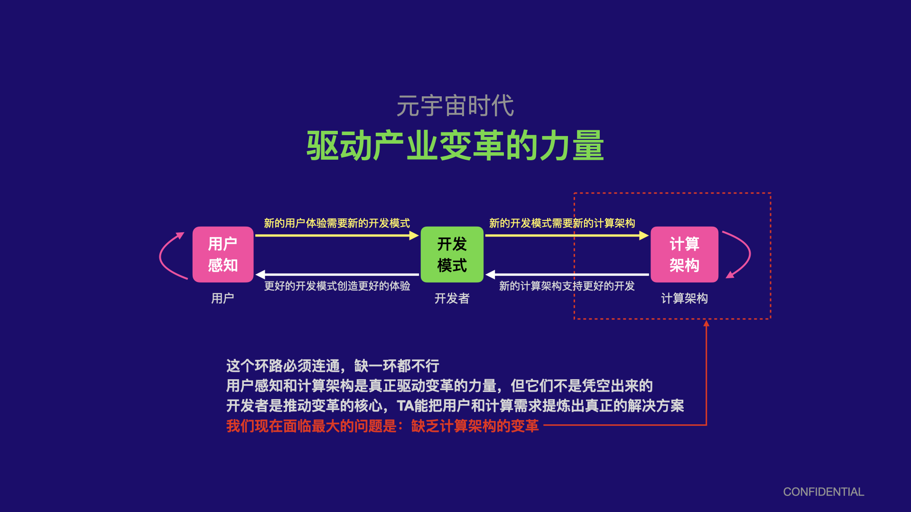

元宇宙代表的不仅是一种新的体验，它将对整个社会甚至数字信息化的进程带来全方位的影响，这种影响不仅仅是一种新的技术或者一种新的功能那么简单，它将包括对计算架构以及全新的信息表述方式这种深层次的变革。

很显然，这种由用户驱动的全新体验需求，用当下的技术架构是做不到的，而且它的限制的根源来源于更底层的计算架构。在近几十年的计算机时代中，底层的计算架构基本上没有发生太根本性变化，例如我们能感知到的：

- 近10年编译架构基本上没有太大变化，一些10年前的经典著名基本上现在还是适用的
- 近10年编程语言的发展也没有革命性的变化，不仅至2010年之后很少推出全新的语言，大部分语言设计也只是针对一些开发体验层面的选择，很多语言的核心思想甚至早在2000年之前就确定

编译和编程语言是计算架构最重要的指向，因为它们连接计算机硬件和应用软件，它们的变革往往能够决定上层软件形态的变革，从而决定技术带给消费者的变革。

当元宇宙带来真正大规模、互操作、大并发等等这些传统计算模型不能应付的需求时，我们需要全新的思路，在计算架构层面创造全新的增量价值，才有机会驱动整个元宇宙的变革。
