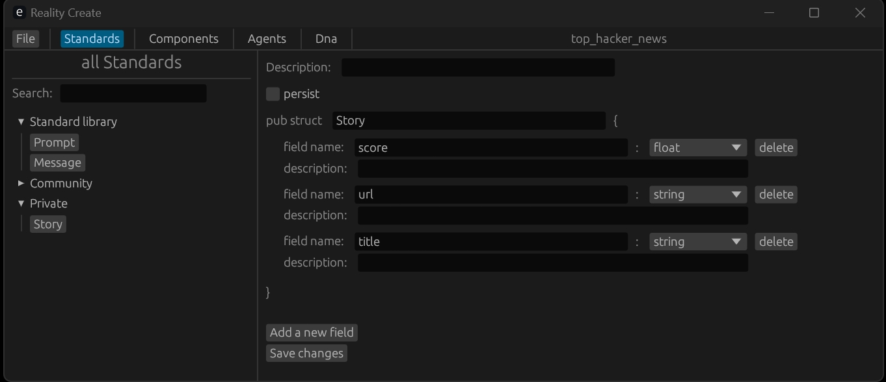
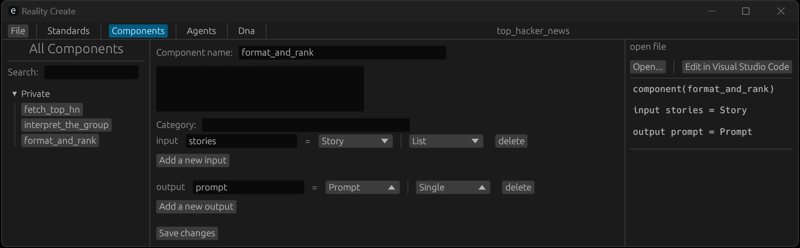
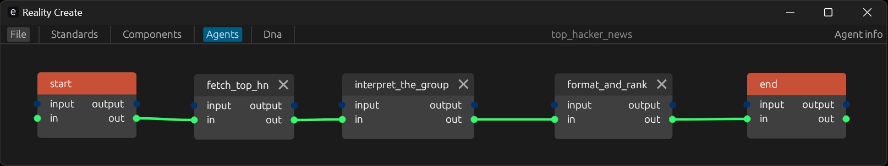

First define a Story struct with editor:



Then define your component's input and output using the above defined struct also with editor:



Then define your logic flow:



Finally write your component's code with Lua:

fetch_top_hn.lua:

```lua
function updating()
    local story_ids = get_url("https://hacker-news.firebaseio.com/v0/topstories.json?print=pretty")
    for i = 1, #story_ids do
        local url = string.format("https://hacker-news.firebaseio.com/v0/item/%s.json?print=pretty", story_ids[i])
        stories[i] = get_url(url)
    end
end
```

interpret_the_group.lua:

```lua
function updating()
    local prompt = string.format("Based on the following list of HackerNews threads, filter this list to only launches of new AI projects: %s", table_to_string(stories))
    local result = chat_completions("Please only return the result list as a RFC8259 compliant JSON format with no '\' character, no extra information", prompt)
    if result["ok"] == true then
        for i = 1, #result["content"] do
            local story = {}
            out_stories[i] = result["content"][i]
        end
    end
end
```
format_and_rank.lua:
```lua
function updating()
    local prompt = string.format("this list of new AI projects in markdown, ranking the most interesting projects from most interesting to least. %s", table_to_string(stories))
    local result = chat_completions("Please only return the result list as a RFC8259 compliant JSON format with no '\' character, no extra information",prompt)

    local msg = "The news with AI topics are:\n"
    if result["ok"] == true then
        for i = 1, #result["content"] do
            msg = string.format("%s%d. %s\n",msg,i,result["content"][i]["title"])
        end
    end
 
    message["content"] = msg
    message["receiver"] = "user"
end
```