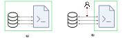
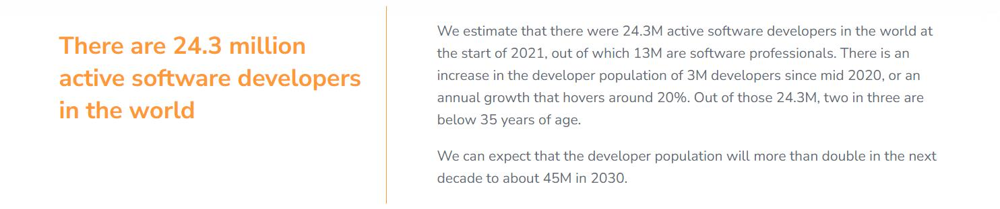
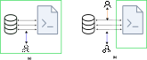
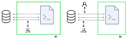
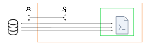
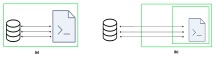

<h1 align="center">一种自我进化的、可互操作性的分布式应用系统</h1>
<br/>

<p align="center">秦春林</p>

<br/>

Reality World是一个以互操作性为核心目标的分布式系统和架构，它的愿景是构造一个无边的数字世界，使得任何人都可以向这个系统动态添加新的子程序，这些子程序可以和其它子程序任意交互，这个系统可以像生物系统一样自我进化，从而通过复杂系统的机制涌现出更加智能、丰富和个性化的数字世界体验。<br/><br/>

## 摘要

近年来，随着区块链、元宇宙以及大模型的发展，数字世界的构建逻辑和使用形态都发生了很大变化。然而总体而言，目前并没有比较成熟的专门面向这些新型特征应用的底层架构，甚至还没有形成比较清晰和统一的思路，比如这种架构应该有哪些新的特征、形态以及设计目标。尝试构建这样的一套新的方法体系是非常复杂的，我认为核心的难点在于很难单从软件架构的视角去解决这一问题。比如元宇宙类应用，表面上看我们可以在现有的引擎架构上去构建，然后元宇宙背后的核心逻辑是互操作性，它要求来自不同开发者创建的应用之间能够进行交互，从而提供更动态、多元和个性化的数字化体验，然而互操作性和传统的软件开发逻辑是相悖的。再比如多智能体类应用，最近更多的工作意识到这类应用的逻辑更可能需要很多具有独立功能的小智能体进行相互协作来实现，这种多智能体相互协作的逻辑跟复杂系统的行为是类似的，然而我们当前的编程模式并没有针对这样的思想进行设计。从上面的论述可以看出，未来数字世界的软件构造方法，需要考虑更多的跨领域知识体系。本文正是通过对传统的软件架构方法（如面向对象和函数式编程模型）、编程语言及其编译过程和链接过程、区块链、复杂系统、游戏应用架构等跨领域知识进行系统分析，结合这些新型应用的特征，提出了一套系统的架构体系，它包括清晰的设计原则、目标、方法哲学，以及一个包含核心机制的源代码实现。希望此工作可以对未来数字世界基础架构的设计、研究和开发提供有益的指引。

## 问题

近几年，数字世界的形态发生着巨大的变化，一方面似乎是面对互联网红利的逐渐下降，人们需要新的科技引爆点；但另一方面，这些新的概念也在某种程度上折射出一个信息：那就是我们生活中的数字化还不够彻底，还不够丰富，还没有完全释放它全部的力量。

例如在Web 3.0的概念中，我们希望我们的隐私和资产能够不被少数中心化的实体所控制；在元宇宙的概念中，我们希望任何人能够进行更自由地创造数字内容，并使我们的数字分身连同我们的很多能力能够在跨域多个虚拟世界中进行互操作，从而提供接近现实世界的数字生活体验；而在大模型应用中，随着大模型对人类任意指令的语义理解，固定的软件逻辑似乎无法应付这种逻辑复杂度，我们希望应用内部能够更智能地协调和调度正确的功能来解决任意的问题，而不是像过去那样提供固定结构和功能的软件。

所有这些新的需求可能都意味着我们需要新的思维和方法来构建应用，而人们自然是希望基于现有的软件工程体系，能够进行少量的架构设计，来实现上述这些应用的开发。本节我们就来看几个基本的问题，从而理解我们现行的体系在解决这些问题方面会遇到哪些挑战，这些问题的理解也为后面的架构设计提供重要的依据。

当然，这只是几个典型问题，本文后面的内容还会讨论更多的相关问题。

### 去中心化和数据安全

我们现代整个构建软件的方法体系，不管是底层的编程语言及其提供的一些编程模式，如面向对象或函数式编程，还是中间一些帮助构建各种应用的工具，如游戏引擎和各种开发框架，都是基于这样一个前提或假设：即程序拥有所有的权力，程序可以控制和访问一切数据，不管是内存中的数据，还是应用本地持久化存储的数据，还是应用存储到云端的数据。这样做的目的是简化编程模型，这种简化的思想体现在两个层面：

- 操作系统为每个应用分配独立的内存空间，因此通过这种简单的内存隔离就可以保证应用的数据安全
- 将应用内产生的用户数据的管理交给开发商，由他们负责保证数据的安全

从上面的机制可以看出，尽管现在各国都应相应的合规法律来保护用户的隐私数据不能被非法上传或使用，但实际在操作层面，很多数据的交互涉及到功能层面，例如需要在云端与来自其它用户的数据进行计算，所以很多数据其实很难界定，因此我们的隐私数据一般只包含部分数据，而还有很多应用执行过程中产生的数据也是对用户而言很重要的。

由于应用程序对数据的天生的权限，使得软件开发商天然的成为一个中心化的实体，掌控着所有用户的数据。尽管很多时候，这种中心化的管理带来了很多便利和效率，但是对于用户而言损失则是很大的，除了数据被非常使用的风险，还有包括在平台获取合法收益时不透明性，没有话语权，同时出于竞争考虑，一个应用的数据对同一个用户的其它应用通常是无法互操作的，而这种互操作很多时候对用户来说是很有价值的。



这里面的根本问题，我觉得是这个编程模型的问题，它将程序的功能和程序执行过程中产生的数据关联在一起，彼此无法分开，如上图（a）所示。想想我们现实生活中的经济模式，一个厂商生产了某件商品，用户购买商品之后，除了简单的售后服务关系，用户和厂商之间就没有其它关系，该商品后续生产的物品都有用户自己拥有，用户可以将这些物品用于任意自己的意图。

所以，为了更好地保护用户的权益，我们需要一种天生能够将软件的数据和功能分开的机制，本文就会提出一种机制，使得开发者使用类似现有的方法进行软件开发，但是其产生的数据确实天生由用户控制的，换句话说，即使是同一个应用产生的数据，用户都可以在后续的操作中禁止该应用对之前产生数据的访问，而且这种控制方式非常简单，如上图（b）所示。

这种编程模式的改变，会对应用的形态造成非常深刻的影响，它也会带来更多新的技术上的可能性，使得我们可以构建更加复杂丰富的应用。这些特性也正是元宇宙和Web 3.0数字经济的构建所需要的基本特性：它使得互操作变得简单和可能。

### 互操作和用户内容创作

尽管元宇宙还没有明确的定义和形态，但是它的一些基本特性也慢慢被人们接受，比如虚拟与现实的结合，用户生成内容，去中心化和开放性，以及数字身份，社交和经济系统等等。元宇宙看起来包括了Web 3.0的思想，但是它可能并不寻求所有的数据都保存在区块链上，因为那样在理论上根本无法满足人们的使用体验需求。

从上面这些特性中，我们可以看出它们对现行的技术体系都会带来很大的挑战。其中关于去中心化和价值交易部分可以由区块链技术来实现，从本文后面也可以看出，互操作性和开放性方面也可以由我们上一节提出的程序架构来实现，然而对于用户创造的程序内容本身，依然存在比较大的挑战。

真实世界的经济系统的核心，是这个经济系统的大部分参与者都在参与经济生产，通过经济生产创造价值，然后才是交易。想想我们每个人都在上班，创造不同的产品，从事经济生产，然后人们用赚取的工资通过交易来换取其他人生产的有价值的东西，这个系统中的经济价值主要是由所有人一起创造出来的。

一个繁荣的数字经济系统也不例外，然而我们看现在的数字经济，从事生产活动的人是极少的，根据[Deverloper Nation](https://www.developernation.net/developer-reports/de20)网站统计，2021年世界上只有2430万开发者，预计到2030年也只有4500万开发者，这在人类人口数量中不足0.5%，如下图所示：



尽管在今年大模型在代码生成上表现出极大的潜力，甚至微软CEO Satya Nadella也提出未来可能借助大模型的能力，使得10亿人可以成为开发人员：

> “I mean, there can be a billion developers. In fact, the world needs a billion developers… So the idea that this is actually a democratizing tool to make access to new technology and access to new knowledge easier, so that the ramp-up on the learning curve is easier.”

然而随着大模型在辅助代码编程方面的使用，例如Github Copilot，我们也逐渐意识到大模型虽然能够在一定程度上提升开发效率，但是它对专业人员的要求依然很高，换句话说，依然只有比较专业的开发人员才可以更好地使用它。这还只是考虑它在局部代码模块，例如单个函数级的代码生成，还不包括更复杂的程序结构和上下文逻辑管理。实际上如今的大模型在理论上主要以预测前后相关的线性序列来实现内容生成，这种理论在针对程序结构这种非线性、组合式的复杂任务上似乎存在一定的理论限制，如 [Faith and Fate:Limits of Transformers on Compositionality](https://arxiv.org/abs/2305.18654) 这篇研究工作指出。

除了编程语言本身，元宇宙类的应用还要求更多的动态性，以及更重要的是在一个宿主程序中安全运行第三方子程序的能力，这会带来非常大的安全性挑战，尽管我们现在有一些如Web Assembly等包含的沙盒技术可以在理论上实现这些机制，但是在根据层面还没有比较简易可靠的框架可以使用，因为这种框架还需要协调应用程序本身的构造和运行机制。

### 多智能体相互协作机制

多智能体（Multi-Agents）是AI领域现在比较热门的一个方向。大模型对于自然语言的理解和对话能力，使得一些借助大模型内部的知识来完成推理和规划的Agent应用广受关注，例如AutoGPT、Generative Agents、BabyAGI等等。然而人们实际在开发中，也由于逐渐受限于大模型的能力，使得单纯简单依靠大模型来推理的Agent会比较难以落地，实际的Agent开发往往还是要涉及大量的逻辑开发，当然其中的逻辑交互主要涉及的是自然语言，也正是受限于大模型在自然语言理解方面的鲁棒性，实际的开发都是需要设置大量精巧的提示词工程才能达到比较好的性能。

不管是受限于单一Agent在记忆管理方面的不可靠性，还是由于越来越复杂的交互逻辑使得Agent开发和管理的复杂度逐渐增加，越来越多的工作将焦点转移到了多智能体系统上，即通过在一个共享的环境中让多个具有不同决策能力的Agent共同协作来完成一些指定的事情。尽管我们可以使用传统的方法来开发这类多智能体系统，例如基于LangChain，然而实际上多智能体协作机制有一些新的技术特征。

多智能体主要的技术特征是动态性，由于Agent的数量极多，成百甚至上千，那么这类系统要具备动态的能力，能够动态添加或移除一些Agent，同时具有较好的容错性，其中的某些Agent出现运行错误时，系统可能缺乏某些方面的能力，但是不影响其它能力的正常运行，在这些出现运行错误的Agent恢复运行后整个系统能够动态容纳该能力。

这看起来像是Actor模型尝试解决的问题，[Erlang](https://www.erlang.org/) 是Actor模型比较有知名度的代表，如果我们把一个Agent比作一个线程或者Actor，那么Actor模型的工作机制似乎就可以实现多智能体交互的需求。开源项目 [Chidori](https://github.com/ThousandBirdsInc/chidori) 也正是基于该理念的一个多智能体开源项目。在这类架构中，单个Agent会订阅某类信息，然后系统会维护这类信息的分发，使得一旦有Agent发出了某类信息，订阅该信息的Agent就会得到响应，信息本身充当了交互的接口和机制。

相对于多智能体的需求，这类架构还存在着两点不足：

- **缺乏数据互操作的机制或Agent之间通信的协议**，每个Agent之间主要是通过字符串进行通信，这样保证Agent和Agent之间的功能解耦。然而这样的隐式协议通常不便于Agent之间的协作，特别是来自不同的开发者之间的Agent，它们在通信格式上没有显式的保障机制。此外，Agent相较于一个Actor算是一个比较大的线程，内部本身还包括很复杂的逻辑，也就意味着Agent内部可能还包括着大量需要获取用户数据的逻辑，这其中有些数据是来自其它程序的定义，这也需要互操作性的支持。
- **缺乏开发这类应用系统的方法论**。多智能体协作类似于一种复杂系统，复杂系统的一个典型特征是它的行为或功能是不可预期的，它们是靠很多逻辑简单的子系统相互作用涌现出现的，这就意味着我们不光是需要开发这种系统的工具，还需要一套系统的方法论来帮助我们测试或预测系统的功能行为，使之符合用户的预期，否则复杂系统在大部分情况下可能会表现出未知的行为。

第一个问题也是传统简单的Actor模型在复杂项目中会遇到的问题，传统的Actor模型一般有两个假设：一是Actor足够小，甚至几乎就是一个函数；二是Actor函数功能本身类似纯函数，这样它内部就没有状态，整个问题就简化了很多。这种模型针对那种只是业务量多、但是业务之间相对独立的业务场景是比较合适的，例如Erlang本身针对的电信业务场景，以及Web服务类应用。但是针对更一般的业务场景，业务之间都穿插着大量的数据交互，这种交互没有比较简单的规则，所以我们传统的程序开发，最复杂的部分，也许就是这种数据管理的复杂性：每个业务函数本身的逻辑可能是比较清晰的，但是为了执行这个函数以及为了知道什么时候需要执行这个函数，我们需要从整个程序到处去寻找条件，例如来自各个地方的上下文数据，和各个逻辑的前置条件，这通常没有一个简单的解决方案，这可能也是编程学习门槛中相对编程语言语法本身更复杂的部分。

在后面的介绍中，我们将通过类型系统以及对应的互操作机制，来解决这个问题。同时也会通过更深刻地洞察和借鉴复杂系统的一些思路来解决第二个问题。

## 相关知识

本节我们会简单介绍一些零碎的已有相关知识，当然这里仅介绍它们的一些基本概念和思路，其目的是为了理解其中的思想，从而更好地理解我们的架构怎样去采用这些思想，又做出了什么调整，为什么要做出这样的调整，以及做出了这些调整之后带来了什么新的变化。

### 互操作性

互操作性的 [定义](https://en.wikipedia.org/wiki/Interoperability) 如下：

> **Interoperability** is a characteristic of a product or system to work with other products or systems.

由定义可以看出，互操作的本意在程序的环境下就是函数调用的能力，但互操作性大多是指两个相对比较隔离或者不同语言的系统之间的函数调用，内部的函数或编译到程序内部的第三方函数调用则不需要强调它的互操作性意义。例如宿主程序与动态脚本程序之间的互操作，例如C++与C或者Rust与C之间的互操作，甚至一个虚拟机支持的多个语言编程的程序之间的调用或通信。在这类情况下，被调函数的类型是无法被编码到程序中的，这通常需要程序内部实现一个对应的内部类型，然后相互之间通过某种格式的字符串来传递信息。所以互操作通常是和标准相关的：

> If two or more systems use common data formats and communication protocolsand are capable of communicating with each other, they exhibit*syntactic interoperability*. XML and SQL are examples of common data formats and protocols.

传统的软件世界通过一些标准来建立互操作的基础，例如HTML、XML、SQL、USD等等，比如Nvidia就基于USD构建了Omniverse，由于其对USD格式的良好支持，使得其可以兼容大部分的内容制作工具，就构建起一个以Omniverse为中心的内容和应用生态。

Tim在2019年的演讲[《Foundational principles & technologies for the metaverse》](https://dl.acm.org/doi/10.1145/3306307.3339844)中大量提到了标准，为了实现多个独立应用程序之间的协作，那么必然要建立大量的标准，有了这些标准，互操作就变得简单，例如《堡垒之夜》现在的Creative模式实际上已经有了很多标准，比如一个物体怎么摆放在环境中，并可以被其他玩家交互，这都是可以由Device来定义的，这实际上就是一种形式的标准或者接口，只要遵循这些标准，则可以很轻易的与其他的环境进行交互。

然而这种基于文本标准的方式仍然有一些缺陷，例如其数量是非常少的，通常必须等一个组织对一个标准有一定影响力之后才能形成实时上的标准，被更多的三方兼容和支持。想想现实世界，各个实体之间的交互和联系几乎是无所不在的，例如一个人在路边新开了一家饭店，路过的人随时可以进去吃饭，不会说还要先接一下饭店定义的一个接口。而程序是必须有严格的逻辑的，比如保证地址、参数和接口的一致性才能进行互操作，这给软件世界的互操作带来了一定的困难。我们应用程序开发的流程通常都是先定义内部数据结构，实现软件功能之后，再以一定的形式封装一些接口，并以某种方式公布出来，由感兴趣的三方去集成。然而实际上有大量的软件开发者是没有精力或者能力去提供这些接口的。想象一个场景：开发者A开发了某个应用给用户新增了一种新的健康类的数据信息，这个数据本来是属于用户的，这个时候用户想要用这个数据来实现另一个事情，TA想自己或者说让其他开发者B帮助开发一个应用来使用这些数据，这种情况下通常是做不到的，因为开发者A可能并没有太多动力去提供这个接口，因为TA可能要耗费很大的精力，除非平台提供一些这种非常便利的机制使得TA可以很轻易地暴露出来。

其实更深刻一点理解，互操作问题其实是一个软件碎片化的问题。传统的软件开发都是先开发内部数据结构和数据存储，然后在必要的时候再把API包装使用某种形式的标准包装成外部接口，这样就造成碎片化，因为即使是针对同样的一类逻辑和数据，不同的应用程序或服务往往会定义不同的数据结构或处理逻辑，这就形成API的碎片化，使得相互之间非常难以协作。试想你可以在两个应用之间协商修改各自的API接口及定义，这是一对一的关系，或者说像支付宝这种平台性质的接口也是容易定义，这是一对多的关系，一对多的关系发展显然是缓慢的，必须让这个“一”有机会且需要时间发展壮大。如果我们希望一种更加高效，更加丰富的协作机制，那么显然我们需要多对多机制，这里面就要求我们对软件开发流程做一些调整。


要想实现这种机制，其实现有的很多技术可以给予很多启示。我们先看USD格式，尽管从表面看USD跟其他的标准类似只是一种数据格式或协议，但实际上它远远不止如此，它还是一种非常易于扩展的格式，它提供了一种plugin的机制使得开发者可以对格式做很多定制和增强功能，并且可以通过一个Schema定义来生成自己定义格式的解析代码，然后通过Plugin来调用自定义的格式解析和代码。这就好比它帮助你编写了文本格式的编解码，尽管看起来不过如此，看起来只是一种模板化的代码生成机制，但是当这种解析代码能够与逻辑高度融为一体的时候，事情的本质发生了一些变化，试想使用USD你的流程是这样：首先针对一种特定数据自定义一个Schema，然后调用USD的API帮助我们生成相关的解析代码，如果这段解析代码能够以某种机制被其他开发者拿到，那么TA的程序就能够轻松解析我们的API。当然如果你修改了Schema，仍然需要对方进行同步，但是这种流程本质上改变了我们的思路：过去我们是先定义内部做法，再与外界沟通，这就容易带来一些复杂度和碎片化；现在是我们先想着自己就是基于一种标准在开发，然后需要的时候就能够很方便地暴露出去，这里USD充当了一种协调的机制并为这种协调的机制提供了一些辅助功能。苹果的usdz格式以及英伟达的MDL都是基于USD的这种扩展能力来实现自定义的资源格式。

API碎片化的第二个例子是LLVM，本质上LLVM在编译器领域的创新主要做的是模块化，早期的编译器开发，各个前端都要分别集成各个后端，编译器开发的复杂度非常高，这里面其实就是多对多的问题，看似很简单，每个前端与每个后端分别调一调，但随之代码的管理和维护成本是很高的，有时候某些内部设计不一致就会导致大量的重复，这就是碎片化问题。由内而外的设计总是不可避免会导致碎片化，碎片化带来软件复杂度，管理和研发成本。当LLVM提供了一个统一的低层IR表述之后，编译器的复杂度大大降低，比如现在能够很轻易地开发一些DSL语言，因为你完全不需要操心后端，只需要把你的代码生成LLVM IR即可。

当然LLVM并没有提供类似USD那种生成格式的机制，那是因为LLVM只有一种IR，所以写成一种固定的格式即可，过去的编译流程基本上都比较简单、固定。但是随着现代深度学习编译器的进展，由于深度学习有着相对比较特定的数据表述，各个公司内部都有开发一些特定的编译流程，它是比一般的LLVM IR更上层的抽象，所以我们对多层级IR表述又有了需求，于是在LLVM的基础上又发展出MLIR，它允许开发者社区能够自定义IR。然而与USD的Schema非常相似的地方是，MLIR为了避免碎片化，使不同开发者自定义的IR之间能够更轻易的协作，它也提供了一种类似的代码生成机制，在MLIR中称为Dialect ，例如如下的Dialect定义：

```text
def Toy_Dialect : Dialect {
let summary = "Toy IR Dialect"; let description = [{
    This is a much longer description of the
    Toy dialect.
    ...
}];
  // The namespace of our dialect.
let name = "toy";
// The C++ namespace that the dialect class // definition resides in.
let cppNamespace = "toy";
}
```

生成的C++代码如下：

```cpp
class ToyDialect : public mlir::Dialect {
 public:
ToyDialect(mlir::MLIRContext *context)
  : mlir::Dialect("toy", context,
      mlir::TypeID::get<ToyDialect>()) {
  initialize();
}
static llvm::StringRef getDialectNamespace() {
  return "toy";
}
void initialize()
```

这样多种IR就可以能够被轻易组合使用，你可以选择社区各种丰富的模块进行组合，来生成特定的编译流程，所以MLIR又称作“生成编译器的编译器”。实际上，碎片化在工业界是一个很大的问题，每家公司在开发自己的软件的时候不会考虑那么多，觉得我只要投入研发资源把自己软件做好就行，但是真正在用户侧使用的时候，TA可能需要多个软件是可以相互协作的，甚至你的用户可能就是开发者，这个开发者可能希望不同的软件可以被更高效的集成和管理。LLVM的作者Chris Lattner最新的创业公司Modular实际上核心就是解决这个问题，他的新编程语言Mojo，除了一些语法层面的传统一点的东西，很多核心能力都是来源于底层的MLIR，其中MLIR跟Mojo有更深度的整合，使得Mojo具有很强的元编程能力。Modular的最核心的逻辑其实跟当年的LLVM类似，解决碎片化问题，当然Modular有很多现在软件的运营思路可能会形成更好的平台和生态，因此它是一家商业公司，不仅仅是一个开源项目。

上述的软件架构都为解决应用之间互操作及其碎片化提供了很好的思想，然而为了更好的软件协作，这些机制还不够。上述的软件都是比较偏底层的基础软件，而不是面向上层用户侧的，因此不需要考虑很多其他问题，比如性能和格式的进化。当进入到一个更上层的消费端应用，首先上述的方式在不同的模块之间交换的都是文本数据，如果你让一个实时的游戏内部的每一次互操作都需要编解码文本，这显然是会影响性能的；此外，应用层的需求更容易变化，即使平台提供了一种生成统一格式解析的代码及其发现的机制，但是怎么应对这些格式的更频繁地变化呢？为此，RealityIS在这些方面做出了一些创新尝试。

### 面向对象编程模型

我们现代的项目开发使用的编程语言，或多或少大部分是和面向对象相关的，尽管看起来面向对象的本质是让我们更好地封装各自比较独立的逻辑，使大规模软件组织起来更加轻松：你不需要关心其他对象的内部逻辑就可以轻易地和它们一起组合起来协作。

然而实际上并不是这样，大部分面向对象编程语言会让人（特别是初学者）误以为编程就应该这样，它是在模拟真实世界的运行机制。那为什么这么完美的模型却没有产生这么完美的体验呢？直到最近一年多对面向对象的更多理解（特别是Erlang）才体会到其中一些问题。

Erlang之父Joe Armstrong在一次采访中（[Ralph Johnson, Joe Armstrong on the State of OOP](https://link.zhihu.com/?target=https%3A//www.infoq.com/interviews/johnson-armstrong-oop/) ）讲到：

> Alan Kay himself wrote this famous thing and said **"The notion of object oriented programming is completely** [misunderstood](https://www.zhihu.com/search?q=misunderstood&search_source=Entity&hybrid_search_source=Entity&hybrid_search_extra={"sourceType"%3A"answer"%2C"sourceId"%3A703226836})**. It's not about objects and classes, it's all about messages**". He wrote that and he said that the initial [reaction](https://www.zhihu.com/search?q=reaction&search_source=Entity&hybrid_search_source=Entity&hybrid_search_extra={"sourceType"%3A"answer"%2C"sourceId"%3A703226836}) to object oriented programming was to overemphasize the classes and methods and under emphasize the messages and if we talk much more about messages then it would be a lot nicer. The original Smalltalk was always talking about objects and you sent messages to them and they responded by sending messages back.

Alan Kay认为OOP的核心是关于消息，但是这样说其实我个人觉得并不太好理解到本质，因为消息更像是OOP这种设计下的一种机制或结果，而不是OOP本身的定义。我觉得OOP的本质应该是隔离，只有做到真正的隔离，才能真正降低系统的复杂度，因为绝对的隔离使得你完全不需要也不能了解另一个物体内部的运作，你们只需要通过一些外在的属性进行交互，我们的开发也仅需要了解这些简单的外在属性。现代大部分编程语言更强调的是object和class，认为对象的核心是关于封装，这本身也没有错，封装的目的也一定是为了让别人不需要关注你的内部细节，但问题在于，很多面向对象编程语言忽略了隔离的意义，为了方便程序员更灵活直接地获取数据和方法，提供一些机制，使得一个对象可以很轻易地访问到另一个对象内部的、跟其内部运作相关的数据或方法，这些原本是需要绝对隔离的。这种设计就使得隔离失去了意义，尽管我们可以指定规范要求自己以对象为单位进行绝对隔离，但是大部分情况下，我们很难做到一个很好的设计，最后的结果是程序内部对象之间相互耦合太多，不管是管理、维护、理解起来都是花费很大的精力。

Erlang就采用了一种不同的机制，它从语言体系上就不允许对象之间能够直接访问内部数据或方法，每个函数都分配为独立的线程，线程之间只能通过消息进行传递和联系，这样程序员就很难写出耦合比较深的代码，同时这种隔离对并行计算和分布式也带来了好处。所以Joe Armstrong说，根据Alan Kay的描述，Erlang可能是唯一真正面向对象的编程语言：

> Erlang has got all these things. It's got isolation, it's got polymorphism and it's got pure messaging. From that point of view, we might say it's the only object oriented language and perhaps I was a bit premature in saying that object oriented languages are about

再回过来看面向对象的核心为什么是隔离，是因为真正的隔离机制才能保证避免耦合，才能降低软件复杂度，因为一个大型的软件系统有无数的对象，如果对象之间存在耦合的可能，那维护起来将是非常不容易的。而当你只提供了强隔离的机制，不让程序员能够很方便地获取另一个对象的引用，剩下的结果就是对象之间只能通过消息通信了，这就是Erlang的整个架构设计，这也是为什么Erlang是真正的面向对象编程语言。也因此，消息更像是隔离机制带来的结果。

就像现实世界一样，微观的每个原子内部都有自己特定的结构，原子之间相互作用形成分子，进一步形成宏观物体，宏观物体通过内部分子结构形成特定的外在属性，但是其他物体与之交互从来不需要了解其中的内部结构，这就是面向对象的美好世界，然而传统的面向对象编程模式则为了便利为一个对象访问另一个对象的内部结构开了一个口子，这个口子不仅破坏了面向对象的编程思想和精髓，也失去了其带来的好处。

尽管Erlang看起来是一种完美的架构，然而消息通信是一种操作起来不太便利的方式，比如为了进一步解耦它通常是传递字符串消息，字符串需要编解码，带来了性能问题；而另一方面消息编程模型通常是异步的，使得对逻辑的流程管理失去了控制力。RealityIS在这两个方面都做了一些创新尝试，使得开发者既可以像传统的局部变量一样去方面其它对象的数据，又可以像Erlang一样拥有绝对的隔离，这种隔离带来编程复杂度上的减少，降低编程门槛。

### 虚拟机

### 基于组合与ECS

例如游戏就是一个这样的例子，尽管仍然有基于传统的面向对象编程模型来开发的游戏程序，但是大部分的游戏框架或架构或多或少都是基于组件的，因为游戏的逻辑非常复杂，没有比较线性的流程，类似于复杂系统，系统跟系统之间存在非常复杂无序的相关性。游戏中的组件某种程度上类似一个Actor，它们都尝试把子系统的逻辑都尽量封装在内部，不同的是，由于组件之间的交互复杂度非常高，例如一个组件的输入消息会来自多个其它组件，而不是像简单的Actor模型只是一对一的通信，因此游戏程序的执行逻辑是按组件进行排序，每个组件有个语义上的顺序，这样的机制保证只要顺序安排得当，就不用去处理复杂的依赖顺序问题，而且当每个组件被执行时，它需要的数据总是能够得到满足。

### 隔离与沙盒技术

现在整个编程语言以及编译的体系架构，都是基于一个假设，即整个应用程序的所有源代码都被编译为一个单一的应用程序，这也即是编译和构造一个应用程序的主体可以认为是只有一个主体，即开发者，不管你背后是一个大团队或者大公司，最终编译发布应用程序的是一个特定的个人、部门或者组织。这样说有什么意思，这就意味着，整个应用程序的安全性由这个单独的主体负责，你需要解决软件的bug，检查所有可能的安全漏洞等等，保证软件最终运行是可靠的。而对于编程语言来讲，它不对软件的安全做任何假设：理论上，只要你拥有源代码，你就可以几乎访问整个应用程序内存中的数据，所以你必须确保你程序中的所有逻辑行为是正常的。如果所有代码都是由你自己公司的程序员编写的，这当然是天经地义的事情，如果你使用了第三方的开源代码或者闭源的二进制库，你必须由你自己去确保这些第三方的代码不会破坏你的软件运行。

这样天生就将每一个软件当作一个封闭、独立的环境，操作系统的内存分配和管理系统保证你的内存不会被其他进程的程序非法访问，这样软件就可以安全地运行，当然即使如此，你的程序当中涉及对外部数据读取的部分仍然可能导致内存安全问题。然而这种隔离是与我们现实世界的运行方式完全相反的，现实世界整个体系是基于协作和分工来实现文明发展的，计算机本来具有更强大的逻辑体系，然而实际上我们并没有在软件世界建立起比较简单地分工与协作机制。

现代软件变得越来越复杂，这种复杂的体系结构本来就希望能够借助更多的协作与分工的精神和思想来实现更大的复杂度和功能，这种协作的第一个要求是让未受信任的第三方代码可以在你的内存环境中执行代码。这也是《堡垒之夜》面临的第一个问题。按照现代编程语言的一些思路，一个源代码能够在一个内存环境中被执行，那表示其对应的主体知道和负责其中的安全问题，编程语言本身没有太多机制来解决这个问题。这又分为两种情况：静态语言和动态解释性脚本语言。对于动态而言而言，如lua，它们通常不能直接访问内存，开发者所能操作的都是封装在一定类型和对象中，现代大多数编程语言都按照类型进行寻址，也即是类型系统本身基本上可以保证程序的安全，如果你的源代码不知道一个对象的地址，你就不可能访问到它。然而实际现在大多数编程语言都提供静态变量或者全局常量之类的方式，这种方式使得内存环境中的其他代码可以获取到这些共享信息，从而对软件进行破坏。为了避免这种问题，Roblox就对Lua进行了改造，叫做Luau，比如通过禁止全局变量，以及禁止一些能够访问全局变量的库函数等等机制来实现一种沙盒安全，这样第三方开发者开发的代码就可以放心地在Roblox app中运行。

如果第三方未受信任代码是二进制的机器码，这个问题就更严重了，因为机器码是可以访问内存地址和寄存器的，那可以造成的破坏是无法想象的。然而人们仍然希望能够实现类似分工协作的方式，这方面最具有代表性的例子就是浏览器，浏览器是一个非常复杂的软件，现代浏览器往往都可以支持第三方二进制的插件，来提供一些更高性能的增强功能，例如浏览器的字体渲染往往都是使用第三方字体渲染库。为了解决这种由于未受信任二进制代码导致的安全问题，人们提出一些软件隔离（software-based fault isolation，SFI）技术，相对应操作系统或硬件的内存隔离，SFI是用于构建包含未信任组件的安全系统的一种轻量级方法，能够用于减少由于内存安全bug导致的攻击，SFI通过严格将第三方未信任软件限制在自己的沙盒内存区域，来隔离这种内存安全导致的破坏。用例包括浏览器使用SFI来扩展第三方组件，例如经典的Native Client SFI syetem（NaCI）使用SFI来扩展第三方c库，使得浏览器可以使用如第三方的字体，音频，XML解析等库；在边缘计算节点与第三方未信任客户环境进行联合计算等等。

NaCI存在较大的运行时性能，因为它的机制一般对第三方代码不做太多要求，假设其按照一般的方法进行开发，然后仅仅在调用这些方法的时候为其分配独立的内存区域进行隔离，它基本上是用软件模拟操作系统的内存隔离机制，比如每次切换都需要保存大量的状态和寄存器地址等等。为了减少这种隔离导致的代价，Web Assembly就使用另一个思路，由于Web Assembly程序都会编译为Wasm文件，由Wasm虚拟机解释执行，而不是底层的二进制代码，所以Web Assembly有机会对程序进行一定的分析，通过基于Control-Flow Integrity (CFI)技术，Web Assembly的编译器可以检查出程序中哪些代码可能会对这种沙盒环境造成破坏，从而禁止这样的代码生成合法的Wasm程序，因此也就实现了沙盒安全。但是由于这种检查是在编译期，并对第三方程序的构造过程有一定的要求，因此在实际执行的时候就可以避免在这种隔离安全的保护机制上花费过多的开销。

Web Assembly之所以是一种未来非常有潜力的技术，不仅仅得益于对Web的友好，接近机器码的字节码，多语言支持等等，这种沙盒技术也是很大的一个技术点。在Web Assembly之前还没有一种技术可以很好地普及和运用沙盒技术，例如JVM上有一些方案，但大多有些性能问题，或者不能完全保证安全，或者方案比较重。Web Assembly这种优秀的沙盒技术使得沙盒模式在以后的软件构造中可能被大规模使用，也就会实现更多的软件协作与分工，事实上比如现在对未受信任多应用环境要求比较高的环境如区块链就大多转型Web Assembly，而如Docker和Severless这种对虚拟环境要求比较高的环境也在逐步转向Web Assembly。

尽管Web Assembly的隔离技术非常优异，但是它并没有改变程序本身的构造方式，即如果你的代码本身就不含破坏别人的恶意代码，那么其实你的开发过程与过去的方式并没有什么区别。而RealityIS希望简化编程的开发，如本文后面编程方面的内容，我们还希望对编程的体系做出一些调整。因此我们会把各种问题放到一起考虑，而不是单纯一个一个地解决问题。例如软件的可组合性、模块化、编程复杂度的降低、互操作等等。

如后面的内容所知，我们还对应用程序的构造方法进行了调整，而不是仅仅把程序当作一个黑盒子来进行统一的隔离，例如传统的隔离技术大都是基于比较底层的编译惯例，如方法调用（Calling Convention）来设计隔离机制，这样使得不需要对用户的开发过程造成太大的影响。在Reality Create中，我们的每个组件的很多行为和构造过程是由运行时自动推导进行的，因此我们本身已经对用户的开发过程有一定的影响，这同时也意味着我们对程序的结构有着更多信息，因此我们可以在更上层的地方实现一些隔离机制，同时由于上层的机构包含对程序的更多的信息，因此会带来一些新的灵活性和能力。

### 复杂系统

## RealityIS架构哲学

RealityIS的整个架构设计经历了整整一年多的时间，可以参看另一篇文档记录了整个思考过程。整个过程其实是一个非常复杂的思考过程，一开始只有部分残缺的思想，不断在细节和总体之间不断来回切换，慢慢构筑起更完整的体系。所以当回来再来看整个架构时，我们必须要形成清晰而简洁的方法论甚至哲学思想。这不仅有助于后来者更好地理解它，而不需要陷入很多细节，同时这也尤其是这样一个面向未来的技术架构具有学习和研究价值的地方。

定义：

**RealityIS是一个以互操作性为核心目标的分布式系统和架构，它的愿景是构造一个无边的数字世界，使得任何人都可以向这个系统动态添加新的子程序，这些子程序可以和其它子程序任意交互，这个系统可以像生物系统一样自我进化，从而通过复杂系统的机制涌现出更加智能、丰富和个性化的数字世界体验**。

RealityIS通过以下两种理论依据来构筑上述的目标，也即是它的架构哲学：

- **它是区块链去中心化思想的一般化，它将区块链的数字类型延升为通用数据类型，然后通过动态类型系统使得所有虚拟机和程序都可以访问用户任意数据，最后通过数据与功能分离使得这种访问能够被用户授权精确控制**。
- **它以复杂系统为理论基础来构筑整个计算框架，用户开发的程序以小粒度的组件为单位，组件之间的交互不需要全局的中央控制，而是通过类型系统实现局部的自动交互，系统内的组件可以任意动态组合**。

在上述的哲学思想中，去中心化的思想定义了外在结构，而复杂系统的理论定义了内在结构，我们将在后面的内容中详细分析。

从前面的定义可以看出RealityIS的两个主要目标是：

- 互操作性
- 自我进化

这两个目标的目标则是为了进一步实现更彻底更丰富的数字化，使之真正成为一种人人参与的数字经济。这两个目标也是RealityIS能够区分过去的各种软件或分布式系统，完全的互操作性是数字经济的基础，有了这个基础，更多的数字内容才可以更好地协作，从而产生经济行为。而自我进化则意味着，当我们由现在这种固定功能的软件走向更加动态、丰富的数字世界，这种复杂的交互必须要涌现出新的更高的数字智能，这种智能要超过传统单一软件的功能。

为了实现这两个目标，我们以区块链和复杂系统两个比较完善的理念作为理论基础。尽管区块链并不是专为互操作性而设计的，但从下一节的分析可以看出，我们可以从区块链的一些思想中延升出一种一般化的互操作思想，同时又兼具去中心的能力。而复杂系统的原理和方法论则为这种动态的大规模程序的组织和功能涌现提供了比较稳固的理论指导。

从上面的定义也可以看出另一个重要的方面，即尽管RealityIS涉及软件构造方法，但我们并没有涉及较低层的编译和编程语言层面。当然后面会分析，ReallityIS也绝不单纯是一个软件架构，它也涉及到对编译过程和编程语言一些思想的重新解读，以及将来也涉及对编译器和编程语言的某些改造，但是这种改造主要是结构性的，或者说不会对传统编程语言和编译器的核心部分进行修改。

### 建立一个数据抽象

区块链是一个分布式系统，尽管这种系统出现的目标并不是为了解决一般软件开发中的互操作性问题，它也不是为解决传统分布式计算问题而设计的分布式软件架构。但通过洞察它的一些特性，结合互操作性的一些技术需求和特征，我们则可以得到不同的启示。这种启示可以说是RealityIS最核心的部分。

本节我们将从不同的角度来解读区块链系统，以及怎样从这种解读中发现建立互操作系统的方案。

我们可以认为区块链系统有三个技术特征，或者说可以从这三个方面来解读区块链系统：

- 类型
- 数据
- 安全

需要注意的是，这三个层面关注的并不是区块链核心的共识机制的部分，而是它作为一个软件架构的层面。同时这里尽管我们也会涉及去中心化的思想，但是这也并不是指区块链中使用分布式账本存储的去中心化方式，我们考虑的去中心化是指通过一种将软件功能和用户数据隔离的应用程序构建机制，使得应用开发商不再具有掌控用户数据的能力，从而也是一种去中心化的概念。但是这种去中心化依然需要借助某种方式的中心化计算，不过在这种架构下用户对数据具有更透明的控制。

#### 区块链的软件构造视角

如果我们从区块链分布式系统中的任一节点去看，这个节点可以看作一个简单的虚拟机，这个虚拟机每次计算执行一个非常简单的程序，即对某两个账户执行价值交易。我们这里不考虑这个价值交易的算法本身，仅把它当作一个程序，然后思考为了支持这个程序的开发和运行，区块链上的虚拟机应该具备什么功能？

我们知道传统的虚拟机的核心机制实际上就是一个具有某种语法的编程语言的解释器，然后使用这种语法编程的程序源代码作为输入，虚拟机对源代码进行解释并执行，这种编程语言的语法通常支持现代比较高级的一些语法，例如Lua，Python，Java等编程语言都支持这种虚拟机的执行方式。



尽管不是很容易理解，但我们可以把一个程序的结构看成是这样的抽象：即程序由数据、类型和代码组成，如上图（a）所示，当然这里的数据主要是作为程序输入的数据，而不是指代码内部也可以产生的很多的内部数据结构及内存存储，那么这里的类型自然也是指这种外部输入的数据结构的类型。一般的程序，其数据和类型都是定义和存储在程序内部的，用户只是在使用其中的功能。

从这个角度看，我们可以把区块链的账本看成数据，然后账本对应的类型是float类型，对应的代码则是区块链虚拟机执行的共识算法。

但比较隐晦的地方在于，float是一个非常简单的数据类型，并且区块链只处理这种简单的外部输入数据，所以它看起来并不包含一个类型定义。如果我们把这个复杂度延升一下，即如果区块链能处理任意类型的数据，那么就必须要定义类型结构，然后虚拟机以某种方式按照类型定义进行解析。这其实就是传统的虚拟机机制，即输入虚拟机的源代码中包含对于处理的任何数据的类型定义。比如以太坊的智能合约就是比区块链更复杂的脚本语言，它就可以包含更复杂的类型定义。

但是我们这里却不想这么做，因为我们看到了区块链的另一个不同寻常的特性，也就是它的去中心化特性的来源，即它的数据（即账本）存储在一个独立于程序（虚拟机上的共识算法程序）的地方，即数据和程序是解耦的。所以这驱使我们想要进一步弄清楚它的独特的程序组织背后的思想。

如果只是想要单纯地把数据与程序代码分离，直接把数据存储到外部并不是一个好的方法，这里面有几个问题：

- 程序内部仍然会定义解析的数据类型，所以不利于虚拟机扩展处理任意动态的类型
- 存储在外部的数据只是一个单纯的数据，它们并没有多少语义的信息，所以用户既不知道怎么管理它们，也无法理解它们。想想理论上我们任何应用的用户都可以打开存储在应用内部文件夹中Sqlite的数据库，但是哪些数据可能对用户并无太大意义。

用户对数据最通常的管理是授权，保证只有经过用户许可的软件才可以访问这些数据。所以仔细思考区块链系统背后的思想：**即区块链可以做到对数据的授权管理**，尽管区块链的数据也是存储在独立于程序的地方，但是它可以做到对数据的权限管理，尽管这需要共识机制协作来保证，但从程序的机制来看，我们可以理解为这种使对数据的权限管理变得可能的原因在于：

**用户了解数据的意义，然后在交易的时候用户将这个语义传达给虚拟机，虚拟机按照用户指定的意义及权限机制对数据进行处理。**这个意义某种程度上就是类型，用户对一个“类型+数据”进行授权，类型在这里升华为某种语义信息或者意义，因为我们在日常生活中所作的事情，其实大多数都是对某类事情进行处理，而这个类型在我们生活中就是包含特定意义的事物，这些事物我们都可以通过名字或类型来区分，类型充当了代表一件事物的语义。

所以当用户在看待自己链上的一个账本数据时，这个数据不光只是一个数值，同时也代表了账本这个类型，只不过由于区块链的虚拟机仅处理这一种数据类型，所以这个类型被隐式表述了，即使没有任何地方定义这个类型，区块链虚拟机也总是能够正确解析这个数据。并且当用户通过给出密钥进行授权计算的时候，TA表达的就是对账本这个类型的数据进行授权。

所以要想把区块链上述这种程序视角的意义扩展到一般程序，即让任何程序的数据都可以独立于程序的代码而存储，并且用户可以对数据进行授权管理，那么我们可以从一下三个方面对区块链进行扩展：

- 将单一的float类型扩展为一套动态类型系统
- 将数据按类型存储在独立于程序代码的地方
- 虚拟机在运行时配合用户的权限设置对数据进行访问

一下我们分别深入分析这三个方面的扩展涉及到的一些思考和逻辑。

##### 类型

程序要对数据进行处理，当然必须要知道正确的数据类型，即知道数据内部的每个字节表示什么含义。通常外部传入一个json字符串，然后程序内部首先会定义一个对应的数据结构类型，然后有一个解析函数对json字符串进行解析并将之转化为内部数据结构的一个对象。如下图（a）所示：



但如前面的分析所知，这里会带来两个问题：

- 用户数据管理和授权的问题
- 程序根据用户授权进行安全控制

由于解析器在程序内部，所以数据对于用户而言仅仅是一些字节，如果有非常多的数据，用户根本不知道哪些数据是对应什么意义，即使用户可以自己去根据文本内容自行判断，甚至给这些文本数据加上一些标签或名字，但是这不仅会增强用户对数据的管理复杂度，而且这种分类行为或结果与实际的数据意义可能还是不一致的。**因此，用户无法针对数据进行授权管理**。

对于第二个问题，由于解析器处于程序内部，那么就无法保证程序会遵照用户的授权结果进行处理。首先同样因为上面无法对数据进行授权的原因，也不存在一个外部程序可以确保数据会按照用户的旨意被某个程序处理，因为谁都不知道这个数据的意义的什么，这种情况下只有将数据传递到程序内部，由程序内部的解析器去做类型解析和分析才知道数据的意义，也就是说只有程序才知道数据的意义，但是这个时候数据已经被传递给程序了。**因此，系统也无法根据用户的授权旨意将数据分配给合法的程序**。

上述的分析要求，数据的形式及其定义应该在一起被管理，也就类型的定义应该处于程序之外，这样不仅用户能够知道数据的意义，从而能够正确地做出权限控制，而且系统可以借助类型系统以及用户的授权组织数据被传入未经授权的程序。即如上图（b）中所示。这就要求类型系统是独立于程序的。

这是一种非常有启发意义的视角，我们单纯去看区块链系统，很难得出这样的思维，但是其实仔细分析也是合理的。我们可以认为区块链其实包含了一个公共的类型系统，只不过这个类型系统只是包含数值类型，也至于我们甚至不需要去定义这个类型系统，这样导致人们对它的类型系统可能没有感知；然后区块链类型系统的解析器是位于虚拟机上的，即由系统控制，系统在对数据按照用户的授权执行权限控制，最后获得授权的请求才会执行最终的交易计算，我们可以认为交易才是真正的客户程序，而交易之前的类型系统和授权计算是属于平台虚拟机部分，这部分客户程序是无法控制的。



最终我们看整个类型系统的架构，它类似于上图所示，这里客户程序（program）仅仅是包含代码，数据被存储在其它地方，用户可以离线对数据进行授权，指定哪些程序可以访问哪些类型的数据。然后运行时这些数据被首先加载的虚拟机VM，虚拟机首先根据类型信息对数据的权限进行判断，如果这个程序被授权，则调用解析器帮助程序解析格式，并最终将程序放入到某个约定的内存地址，最后程序从这个内存地址取值进行计算。

当然实际整个类型系统的工作机制还涉及很多内容，我们在后面架构设计一节将详细介绍。

##### 数据

区块链的另一个特点是数据的存储是未受保护的，甚至是明文的，任何程序都可以获取用户的账本信息。这跟传统的应用程序架构思想也是截然不同的，传统的应用架构就是为了保护用户数据而将数据完全隔离，甚至加密以防止其它程序触碰到数据，但是它们通常在内部则不做太多安全检查，假设对数据的访问都是合法的；而区块链的哲学却不一样，它认为数据的存储不重要，重要的是数据的所有权，所以它的核心是在运行时做授权检查。当然这里只是一种架构上的类比，区块链公开明文数据的机制也是由于其核心的共识机制决定的。



如上图（a）所示，传统的程序将数据隔离起来，以防止其它程序访问，这种隔离机制往往是在编程模型之外的机制，由操系统来提供，因此程序不需要担心数据的安全性。例如常见至少有三种数据保护机制：

- **文件系统和应用程序沙盒环境**，在现代移动操作系统中，每个应用往往都分配有独立的数据存储空间，应用程序可以将其运行过程中产生的数据存放至这里。像iOS操作系统则会为这个程序的空间创造一个沙盒环境，使得只有所属的应用程序才能访问这个环境中的一切数据。
- **操作系统内存隔离**，当一个应用程序启动后，尽管理论上所有的应用程序都是共享计算机硬件的内存，但是现代操作系统及硬件提供了很多隔离机制，使得每个程序被分配一块内存的区域，并且不管其程序代码中访问的内存地址指向何处，都不可能访问到程序之外的隔离区域。我们将在后面讨论这些机制。
- **虚拟机沙盒环境**，像Java、Web Assembly、.NET CLR等现代虚拟机环境，它们往往提供一种多种编程语言的程序互操作的能力，尽管保护力度和性能不一样，它们还或多或少提供了一些在同一个应用内部隔离不同子程序的能力。这种情况下，因为整个虚拟机及运行在其上面的所有的程序都是在一个内存环境中，所以操作系统的内存隔离无法提供保护，虚拟机往往需要模拟操作系统的某些机制来实现应用内的内存隔离。这种情况下，对于虚拟机上的每个子程序来讲，虚拟机环境本身有点类似于操作系统的概念了。

从上面的分析可以看出，过去几十年计算机软件构造的发展历史，逐渐形成这种操作系统与编程模型的分工协作，也是一种硬件上的抽象，在这种抽象模型中，硬件或操作系统只需要提供如文件或内存级别的安全访问机制，而不需要关注应用实际的数据和数据结构，就可以保证数据安全；而对于应用程序，由于硬件或操作系统已经保证了数据不会被其它程序非法访问，那么整个编程模型涉及的机制只需要考虑应用业务逻辑的构造，而不需要考虑数据的访问安全，并且现代编程模型基本上都基于一个假设：即代码可以访问该应用程序内的任何资源，只要它能获取到相应的内存地址，例如在C++代码中，一个指针可以指向和访问任意应用程序内部的内存地址，即使是那些不能使用指针的脚本编程语言，它们的核心也主要是在帮助简化内存管理，而不是阻止对应用程序内任意数据的访问，例如一个对象的引用你可以传递给任何变量从而被使用。

过去几十年，这一套机制运转良好，也体现出这种抽象带来的高效率。但是这种抽象只考虑一个程序及其程序的执行，而没有考虑程序内部数据对于用户的意义。在传统的软件中，软件主要是作为一种单一的功能使用，这种功能很少涉及需要跟外部交互，它们整体在内部是自洽的，如果用户需要另一个功能，TA就去打开使用另一个软件就好。

然而近几年随着Web 3.0、元宇宙和多智能体类应用的出现，这些应用越来越凸显出相互交互和协作的特性和需求，这跟我们传统的应用构成模型是相悖的，数据隔离就失去了互操作性，尽管我们可以通过一些机制去提供一些接口让其它应用进行互操作，但是这些机制架构通常都很复杂、不可扩展、效率低下。

因此，或许我们应该像区块链系统一样，建立一层数据抽象。它可以带来天生的互操作性，同时后面我们将看到，这样的架构调整还可以带来很多新的计算特性。但是首先来看将数据与应用程序分离之后怎样保证数据的安全。

##### 安全

将数据存储在应用程序之外的地方，就失去了硬件和操作系统的保护，那么平台或者应用程序就必须额外提供保护机制。这方面我们也可以从区块链系统得到一些启示，再结合传统架构架构技术的一些发展，找到一个合适的技术方向。

不考虑分布式环境，仅考虑单个虚拟机，我们可以认为区块链计算的过程如下：首先虚拟机从外部环境中获取到用户账本，然后基于用户授权执行验证计算，验证通过则执行具体的交易，我们可以把这三部分分别看作数据、虚拟机和应用程序，如下图（b）所示：


首先数据存储在应用程序的外部，从前面数据部分的分析也可以看出，所以在程序运行的时候就涉及到一个数据的传输过程。关于网络传输的安全性，我们已经有了很多年的软件工程实践，这块并不会带来很大的问题。而实际上，比如在移动端这种情况下，用户的数据大部分是存储在本地的，这并不需要经过网络传输，实际上整个系统只有需要与其它用户进行交互的数据才会进行网络传输。

当数据到达本地虚拟机时，虚拟机首先执行权限计算，然后再决定一个应用程序是否可以获取这个数据以执行某种计算。这里由于虚拟机已知用户的数据类型，所以它能够对数据进行授权管理，用户可以很简单地对每种语义数据对每个应用程序进行授权，只有相应类型被授权的应用才可以访问到对应类型的数据。所以这里虚拟机完全可以执行整个授权计算。

随后，被授权的应用最终可以获取到数据执行某个逻辑计算。尽管数据需要执行权限计算，但是应用程序对这种计算并无感知，它还是像传统应用程序一样进行开发，例如它声明需要访问某个数据，如果这个数据没有被授权，它根本就不会被调用执行；如果数据被合法授权，则它的计算过程跟传统的计算是一样的。整个授权的行为对应用程序是透明的。

这种数据及其安全的抽象，使得应用程序的开发还是利用完整的传统应用开发流程，保证对开发者流程和习惯的影响带来新的学习成本和思维模式转变。而这里的虚拟机则仅有平台进行开发即可。

对于虚拟机的安全部分，传统的一些虚拟机技术如Java、Web Assembly等已经有了很多的实践可以借鉴。本文后面也会提出一些新的调整思路，以解决一些新的问题和新的思考。

#### 数据抽象带来互操作性

同时带来动态性

### 基于复杂系统的计算架构

复杂系统来源于游戏架构，从ECS角度解决了子系统之间共享信息的能力，同时接触耦合

通过将传统主动式计算的模式，即：用户输入-》决策判断-》执行动作

这个模式由于：1）主动计算时机，以及程序对流程的硬编码；2）决策计算时涉及的大量相关性全部被聚集到一起

实际生活中的系统有两个相反的特点：

- 系统是自动，动态运行的，而不只是由用户输入，相反我们需要不断去观察环境的变化，而现代软件本身很少变化，所以的变化基本上都由用户触发，因此用户不需要太多观察和被通知软件环境的变化
- 一个当作执行时的上下文，往往不是执行的时候再去收集，这造成一种耦合，而是各个前置数据有自己的流程，已经先于当作之前被执行，数据已经处理好，计算流程已经发生，后续当作需要的条件就是数据，这个数据隐含了那个计算过程

游戏就是这样一种思维：

- 体验上用户需要实时观察状态变化，而不是只是自己输入时的响应
- 上下文在其它数据中计算出来的

游戏就是这样的系统

智能涌现

软件架构

动态性和进化性

### 外在架构和内在结构

区块链及其对应的互操作性定义了外在结构

复杂系统则定义程序内在的机构

## RealityIS技术架构

对互操作性的改进：

- 又调用过程获取结果，变为直接获取其过程，即将被调过程执行的结果存储在一个语义数据，这样就是一个类型或者数据本身包含了互操作性，就简化为数据管理的问题（游戏中的机制）

### 构建一个动态类型系统

两个目的：

- 类型解析，做依赖分离
- 数据和功能分离，通过类型的解析控制，来阻止未授权程序的访问，当然实际不是运行到某个函数时在检查，而是组件可以根据类型信息提前检查出来

动态授权很重要，如果没有这个控制，只是在Actor之间传递字符串，意味着某个Actor被执行，就无法控制它访问数据。

### 建立一个互操作抽象

逻辑抽象，不涉及编程语言与编译器开发

### 简化数据获取

### 简化程序结构

### 复杂系统：由主动到被动自动运行

局部驱动

应用由主动执行到被动持续执行，跟用户的主动输入不是同步的，可能是自动执行的，用户怎么感知系统变化状态

> 应用由主动执行到被动持续执行，跟用户的主动输入不是同步的，可能是自动执行的，用户怎么感知系统变化状态
>
> https://www.zhihu.com/question/26387327/answer/3158798538

## RealityIS技术特征

### 互操作性

### 个性化

### 动态性

### 分布式

### 语义化

### 组件化

### 被动式

被通知，持续运行

## 应用

## 挑战

### 技术挑战

程序的持续运行模式

### 用户体验挑战

用户从功能管理到数据管理

应用由主动执行到被动持续执行，跟用户的主动输入不是同步的，可能是自动执行的，用户怎么感知系统变化状态

我们需要被通知，而不是一个我要做什么的数字世界

## 总结

##    

